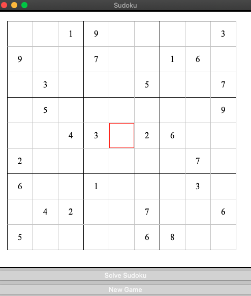

# Sudoku Solver

A Sudoku solving app created with Python using the Tkinter library. 

You can either play the Sudoku by clicking on the square and entering in a number on your keyboard. The cell highlighted in red is the selected cell. 
You may click the Solve Sudoku button at any time and the app will solve the Sudoku using the backtracking algorithm. There are currently six Sudoku boards
to play and one is randomly selected if you click the New Game button.

References:
  * https://docs.python.org/3/library/tkinter.html
